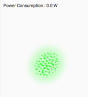
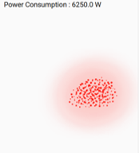

[](https://hacs.xyz/)
[](LICENSE)
<p align="center">
  
</p>

# Particle Cloud Card (Swarm + Cloud)

A Home Assistant Lovelace custom card that visualizes a numeric sensor as an **ambient swarm** (boids / flocking) with an optional **cloud “mist” layer** — designed for power usage, but works with any numeric entity.

- **Swarm motion**: bird-like flocking (alignment / cohesion / separation)
- **Cloud feel**: optional density/mist layer under the swarm
- **Theme-aware**: text/overlays adapt to light/dark themes
- **Generic input**: use any numeric entity (e.g. W, price, flow)

> Typical use case: power consumption in Watts (e.g. 500–800W calm and green; higher loads tighten and intensify).

---

## Screenshots

 <p align="center"></p>
 <p align="center"></p>

---

## Installation

### Option A: HACS (recommended)
1. HACS → **Frontend**
2. Add this repository as a **Custom Repository** (type: Lovelace)
3. Install **Particle Cloud Card**
4. Restart Home Assistant (or reload resources)
5. Add the card to your dashboard

### Option B: Manual
1. Copy `particle-cloud-card.js` to:

   `/config/www/particle-cloud-card.js`

2. In Home Assistant:
   - Settings → Dashboards → **Resources**
   - Add resource URL:

   `/local/particle-cloud-card.js`

   Type: **JavaScript Module**

3. Add the card to a dashboard.

> Tip: If you’re iterating the code, use a cache buster:
> `/local/particle-cloud-card.js?v=1` and increment `v=` when you update the file.

---

## Usage

Basic example:

```yaml
type: custom:particle-cloud-card
entity: sensor.ams_ec5d_p
name: Power Consumption
fps: 24
particle_count: 320
# Lower the particle cound if it lags
# Range tuning (Watts) - adjust to your home
speed_min: 200
speed_max: 2500
color_min: 200
color_max: 4000
size_min: 200
size_max: 2500

palette:
  - [0.00, "#4dff88"]
  - [0.70, "#7dff9f"]
  - [0.85, "#ffd166"]
  - [0.95, "#ff9f5a"]
  - [1.00, "#ff4d4d"]
```
---

## Configuration

### Entities

You can drive speed/color/size from the same entity, or separate entities:
- entity: fallback entity used for all features unless overridden
- entity_speed: drives swarm motion intensity
- entity_color: drives palette interpolation
- entity_size: drives mist blur + overall “density” feel

### Normalization
- min, max: defaults for all features
- speed_min, speed_max
- color_min, color_max
- size_min, size_max

Note: normalization is log-like. For “power-like” sensors, set max to a realistic peak.

### Visual / performance
- particle_count (default 220): higher = heavier CPU (O(N²))
- fps (default 24)
- mist (default true)
- show_value (default true)
- debug (default false)

### Palette

palette is a list of [stop, color] where stop is 0..1:
```yaml
palette:
  - [0, "#00ff00"]
  - [0.5, "#ffff00"]
  - [1, "#ff0000"]
```

## Demo Mode (Manual Slider)

If you don’t have a suitable real sensor yet — or just want to explore and tune the visuals — you can drive the Particle Cloud Card using a **manual slider**.

This is useful for:
- Trying the card without real hardware
- Tuning color, motion, and density
- Screenshots / demos
- Development and testing

---

### Step: Create a slider using the UI (recommended)

1. Go to **Settings → Devices & Services → Helpers**
2. Click **Create Helper**
3. Choose **Number**
4. Configure it as follows:

| Setting | Value |
|------|------|
| **Name** | Particle Cloud Power |
| **Minimum value** | `0` |
| **Maximum value** | `11000` |
| **Step size** | `50` |
| **Unit of measurement** | `W` |
| **Display mode** | Slider |

Save.

Home Assistant will create a helper named: input_number.particle_cloud_power

+ (+)Add Card / By entity - find the helper name.


---

### Use the slider with the Particle Cloud Card
```yaml
type: custom:particle-cloud-card
entity: input_number.particle_cloud_power
min: 0
max: 11000
particle_count: 220
mist: true
```

---
## Development vs Release
- src/ → development source
- particle-cloud-card.js (root) → built release file used by Home Assistant / HACS
---

## Credits
Created by Christian Gruffman.

## License
MIT
